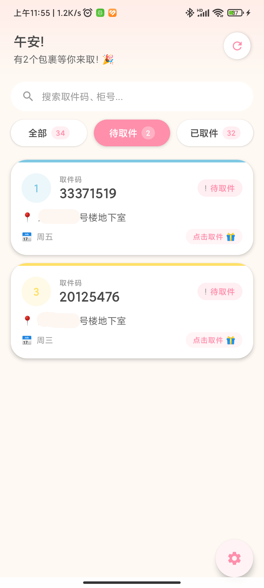

# 快递管家

一款基于 Android 的智能快递管理应用，通过解析短信中的快递通知信息，自动提取并管理您的快递取件码。

## 功能特性

- 📱 **自动解析短信**：自动读取并解析快递柜取件短信
- 🔢 **智能提取**：自动提取取件码、快递柜号、送达时间等关键信息
- 🎯 **状态管理**：支持标记快递为"已取件"或重置为"未取件"
- 📊 **筛选功能**：按状态筛选显示全部、未取、已取的快递
- 🔔 **确认提示**：支持开启/关闭滑动操作前的确认提示
- 🔄 **自动刷新**：应用启动或从后台返回时自动同步最新短信
- 🎨 **现代化界面**：使用 Jetpack Compose 构建精美的用户界面
- 💾 **本地存储**：使用 Room 数据库持久化存储快递信息



## 技术栈

- **语言**：Kotlin
- **UI 框架**：Jetpack Compose
- **架构**：MVVM (Model-View-ViewModel)
- **本地数据库**：Room
- **最低 SDK 版本**：Android 9.0 (API 28)
- **目标 SDK 版本**：Android 14 (API 36)
- **编译 SDK 版本**：API 36

## 项目结构

```
app/
├── src/main/
│   ├── java/anyang/mypackages/
│   │   ├── MainActivity.kt          # 主 Activity
│   │   ├── data/                    # 数据层
│   │   │   ├── PackageDao.kt        # 数据访问对象
│   │   │   ├── PackageDatabase.kt   # 数据库配置
│   │   │   ├── PackageEntity.kt     # 快递数据实体
│   │   │   └── PackageRepository.kt # 数据仓库
│   │   ├── sms/                     # 短信处理
│   │   │   ├── SmsParser.kt         # 短信解析器
│   │   │   └── SmsReader.kt         # 短信读取器
│   │   ├── ui/                      # UI 层
│   │   │   ├── components/          # 可复用组件
│   │   │   │   ├── PackageItem.kt   # 快递卡片组件
│   │   │   │   └── PackageList.kt   # 快递列表组件
│   │   │   └── theme/               # 主题配置
│   │   └── viewmodel/
│   │       └── PackageViewModel.kt  # 快递视图模型
│   └── res/                         # 资源文件
```

## 权限说明

应用需要以下权限：

- `READ_SMS`：读取短信内容以解析快递信息
- `RECEIVE_SMS`：接收新短信通知（Android 13+）

## 安装说明

### 环境要求

- Android Studio Arctic Fox 或更高版本
- JDK 11 或更高版本
- Android SDK 36

### 构建步骤

1. 克隆项目到本地
```bash
git clone <repository-url>
cd MyPackages
```

2. 在 Android Studio 中打开项目

3. 配置签名文件（如需构建 Release 版本）：
   - 将签名文件放置在 `C:/Users/<用户名>/.ssh/android.key.jks`
   - 或修改 `app/build.gradle.kts` 中的签名配置路径

4. 构建 APK
```bash
./gradlew assembleDebug    # Debug 版本
./gradlew assembleRelease  # Release 版本
```

5. 安装到设备
```bash
adb install app/build/outputs/apk/debug/app-debug.apk
```

## 使用说明

### 初次使用

1. 安装应用后，系统会请求短信权限，请点击"允许"
2. 应用会自动扫描并解析手机中的快递柜取件短信
3. 快递信息将自动显示在主界面

### 主要操作

- **刷新数据**：点击右上角的刷新按钮手动同步短信
- **筛选快递**：点击顶部的筛选标签切换显示全部/未取/已取快递
- **标记已取**：左滑快递卡片，点击"标记为已取件"
- **重置状态**：右滑已取的快递卡片，点击"重置为未取件"
- **确认提示**：打开右上角的"确认提示"开关，在操作前会弹出确认对话框

### 支持的短信格式

应用支持解析包含以下信息的快递柜短信：

- 包含"取件码"及5位以上数字
- 包含"XX号快递柜"或"XX号柜"
- 包含送达时间信息

## 数据库

应用使用 Room 数据库进行本地数据存储：

- **表名**：packages
- **字段**：
  - `id`：主键
  - `pickupCode`：取件码
  - `lockerNumber`：快递柜号
  - `location`：取件位置
  - `receiveTime`：送达时间戳
  - `status`：快递状态（PENDING/PICKED_UP）
  - `messageContent`：原始短信内容
  - `pickedUpTime`：取件时间戳

## 贡献指南

欢迎提交 Issue 和 Pull Request！

## 开源协议

本项目仅供个人学习和研究使用。

## 作者

AnYang

## 更新日志

### v1.0.0
- 初始版本发布
- 支持自动解析快递短信
- 支持状态管理和筛选功能
- 现代化 UI 设计
